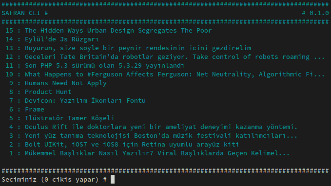
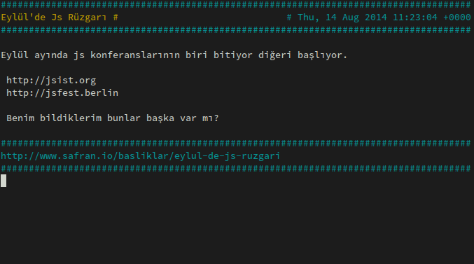
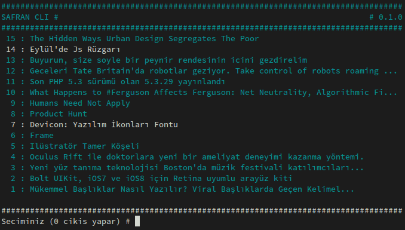
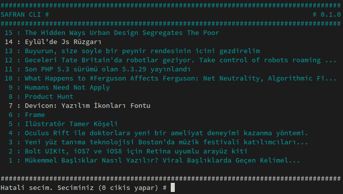

# Safran C CLI

[Safran.io](http://safran.io) için C ile yazılmış CLI uygulaması. Diğer diller ile yazılmış versionlarına [buradan](https://github.com/f/awesome-safran) ulaşabilirsiniz.

## Kurulum

Uygulamanın çalışması için `curl` ve `ncurses` kütüphanelerinin kurulmuş olması gerekmektedir. Bilinen bazı Linux dağıtımlarında bu kütüphanelerin nasıl kurulacağı aşağıda yer almaktadır.

### Ubuntu

```bash
(sudo) apt-get install libcurl4-gnutls-dev ncurses-base ncurses-bin
```

veya

```bash
(sudo) apt-get install libcurl4-openssl-dev ncurses-base ncurses-bin
```

### Arch Linux

```bash
(sudo) pacman -S curl ncurses
```

### Centos

```bash
(sudo) yum install libcurl ncurses-devel
```

## Derleme

Gerekli paketlerin kurulumu tamamlandıysa `make` komutu ile kaynak kodları derleyebilirsiniz.

```bash
make
```

Tekrar derlemek istiyorsanız öncesinde `make clean` komutu ile önceden derlenmiş dosyaları silebilirsiniz.

```bash
make clean
make
```

## Kullanım

Eğer uygulama başarı ile derlendi ise `./safran` yazıp çalıştırabilirsiniz. Açıldığında aşağıdaki gibi bir ekran sizi karşılayacaktır. Bu menüde hareket için başlığın yanında yer alan numarasını yazıp enter tuşuna basmak yeterlidir.



Geçerli bir numara girilmiş ise başlık ile ilgili detaylı bilgiler ayrı bir ekran ile açılacaktır. Geri dönmek için enter tuşuna basmak yeterlidir.



Başlıklar okundukça rengi değişmektedir.



Geçersiz bir başlığa gitmeye çalıştığınız zaman hata mesajı alırsınız.



## Notlar

* Bu uygulama gece yarısında hızlıca yazılmış olduğundan çok fazla eksiği mevcuttur. Kullanmadan önce bunları kabul etmelisiniz.
* Tamamen eğlence amaçlı yazılmıştır. Diğer diller ile yapılanların aksine daha fazla detay ile uğraşma ana felsefesidir.
* Geliştirilmeye açık olduğundan gördüğünüz hataları paylaşırsanız çok daha güzel bir uygulama haline dönüşebilir.
* Kod içerisinde xml parse işlemi için harici bir bağımlılık kullanmadım. Basit string işlemleri ile bunu hallettim. Şimdilik gayet güzel çalışıyor. Eğer rss feed ilerleyen zamanlarda değişikliğe uğrarsa basit makro tanımları ile yeni haline adapte etmek çok zor olmayacaktır.

## Yapılacaklar

* Bazı konsollarda Türkçe karakterler sıkıntı çıkarıyor sanki. Bunun için `char` yerine `wchar_t` kullanmak mantıklı olabilir.
* Değişken isimleri çok anlamsız. Tipinin de anlaşılacağı genel bir isimlendirme notasyonu kullanılmalı.
* Debug makroları mevcut ancak efektif kullanılmıyor. Kodun her yerine dağıtılmalı.
* Uygulamanın açıldığı anda GUI ile verileri çeken `curl` farklı threadler altında çalışmalı. Veri çekilemez ise GUI üzerindeki bir kısımdan bu hata belirtilmeli.
* Yazı içeriğine girince yorumlarda çekilmeli.
* İndirilen veri cache ile tutulmalı. Yeniden yükleme işlemi için r gibi bir komut olmalı.
* Parse edilmiş verinin tutulduğu veri yapısında, kısımların büyüklük değerleri de en baştan hesaplarak eklenmeli.
* Valgrind ile bellek kontrolü yapılmalı. Görüpte düzeltmediğim bazı alanlar var.
* Renk uyumu ve GUI yeniden tasarlanabilir.
* Komut satırı parametreli ile de çalışabilir olmalı.

## Safran Nedir?

[http://www.safran.io/hakkinda](http://www.safran.io/hakkinda) sayfasından:

> Safran yaratıcı servisler ve ürünler tasarlayan/geliştiren topluluklar için düşünülmüş, şimdilik sadece davetlilere açık bir sosyal haber ve paylaşım ağıdır. Severek takip ettiğimiz Hacker News ve Designer News gibi sitelerin Türkçe konuşanlar için bir uyarlamasıdır.

## Lisans

[MIT License](http://halit.mit-license.org/)
